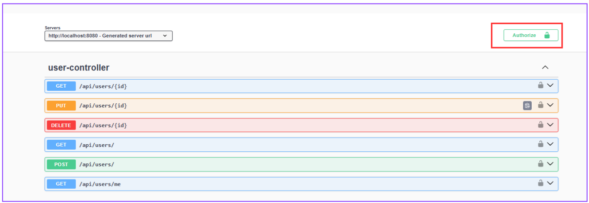
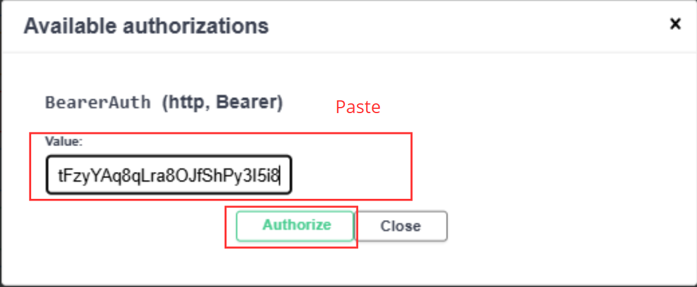

# Project Management Tool

PMT est une plateforme de gestion de projet collaboratif destinée aux équipes de développement logiciel. L'objectif est de créer une application qui permettra aux équipes de planifier, suivre et collaborer sur des projets de manière efficace.

# Project Management Tool

PMT est une plateforme de gestion de projet collaboratif destinée aux équipes de développement logiciel. L'objectif est de créer une application qui permettra aux équipes de planifier, suivre et collaborer sur des projets de manière efficace.


## Environment Variables

- J'ai utilisé VS Code comme éditeur de code pour ce projet. Le projet est développé avec springboot maven et angular, pour cela, vous devez configurer votre environnement de développement.
- Pour configurer votre environnement de développement, vous devez installer les outils suivants:

`Java 17.0.12 ou supérieur` 
`Maven 3.9.9  ou supérieur`
`Node.js 22.12.0 ou supérieur`
`Angular CLI 19.2.0 ou supérieur`
`MySQL 8.0.21 ou supérieur`

## Installation

1. Télécharger le  [JDK 8 ou 11](https://www.oracle.com/java/technologies/downloads/) et suivre les insctructions d'installation
- Verifiez l'installation avec la commande:

```bash
    java -version
```
2. Télécharger [Maven](https://maven.apache.org/install.html)  et suivre les insctructions d'installation
- Verifiez l'installation avec la commande:

```bash
    mvn --version
```
3. Télécharger Node.js et suivre les insctructions d'installation
- Verifiez l'installation avec la commande:

```bash
    node -v ou node --version
```
4. Installer [Angular](https://angular.dev/installation)avec la ligne de commande suivante:
- Verifiez l'installation avec la commande:

```bash
    npm install -g @angular/cli@19.2.0
    ng --version
```
5. Télécharger [MySQL installer](https://dev.mysql.com/downloads/installe/)  et suivre les insctructions d'installation où bien [Dbeaver 25.0.5](https://dbeaver.io/download/)


## Lancement du projet en local
-  Lancement du backend

1. Après avoir installé Dbeaver, crée un serveur sur le port 3306 comme 
        sur l'image suivante :


Veillez à bien remplir ces champs:

* Hostname : localhost
* Username : root
* Password : root

Après avoir configuré la connection,clique sur le bouton Test de connection :


Une fois accedez à la connection, vous accedez à la page vous permettant de faire des requettes SQL.

La requette suivante permet de créer une nouvelle base des données.

```bash
    CREATE DATABASE pmt_db
```

Après l'exécution de la requette SQL, on observe l'apparition de la base des données "donnees" suite à sa création comme sur l'image suivante :


2. Créer un répertoire sur le bureau et ouvrez ce répertoire dans VS Code. Cloner le projet avec la commande

```bash
    git clone https://github.com/Jmour-dh/PMT.git
```

3. Naviguez dans le dossier ressouces Backend_PMT
4. Ouvrez un nouveau Terminal à la racine du projet puis naviguez vers le dossier Backend_PMT, et lancez le script suivant:


```bash
   mvn spring-boot:run  
```

Le backend va se lancer sur http://localhost:8080


-  Reference API

Pour documenter notre API REST, nous avons utilisé Swagger UI (OpenAPI), qui permet :

Une documentation interactive et automatique des endpoints

* La visualisation des modèles de données (DTOs)

* La possibilité de tester directement les requêtes depuis l'interface

* L'interface Swagger est accessible à cette URL lorsque l'application est en marche :
http://localhost:8080/swagger-ui.html

Pour tester les routes sécurisées par JWT Token, voici la procédure à suivre :

1. Authentification :

Effectuez d'abord une requête de login (POST /api/auth/login) pour obtenir votre token JWT


2. Utilisation du Token :

Ajoutez le token reçu dans l'en-tête Authorization de vos requêtes suivantes :
<table>
  <tr>
    <td></td>
    <td></td>
  </tr>
</table>


